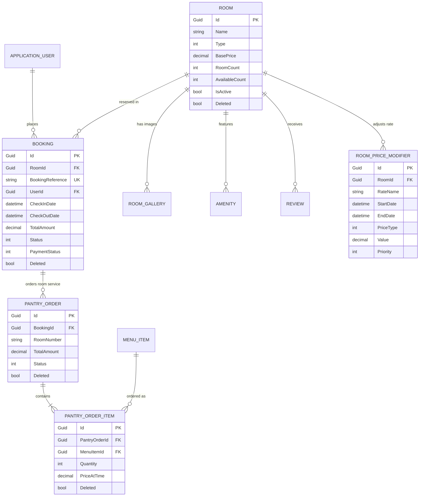

# 🏨 Hotel Management System (HMS) — Microservices Backend

[](https://dotnet.microsoft.com/)
[](https://learn.microsoft.com/en-us/dotnet/csharp/)
[](https://ocelot.readthedocs.io/)
[](https://learn.microsoft.com/en-us/ef/core/)
[](https://www.microsoft.com/sql-server)
[](https://jwt.io/)

A distributed, production-ready microservices backend engineered for modern hospitality management. This platform powers complete hotel operations — from guest authentication, room inventory, dynamic surge pricing, and booking lifecycles to in-house pantry room service ordering and corporate inquiries.

---

## 📑 Table of Contents

- [System Architecture](#-system-architecture)
- [Microservices & Solution Structure](#-microservices--solution-structure)
- [Technology Stack](#-technology-stack)
- [Core Architectural & Complex Technical Concepts](#-core-architectural--complex-technical-concepts)
- [Network Topology & Service Endpoints](#-network-topology--service-endpoints)
- [Database Architecture & Data Integrity](#-database-architecture--data-integrity)
- [API Reference](#-api-reference)
- [Local Development & Getting Started](#-local-development--getting-started)
- [Data Seeding & Automation](#-data-seeding--automation)

---

## 🏛 System Architecture

The solution adopts a decoupled **Microservices Architecture** with an **API Gateway Pattern (Layer 7 Reverse Proxy)** serving as the unified ingress point for client applications.

```mermaid
flowchart TD
    subgraph Clients["Clients & Frontends"]
        Web[Web Application / Admin Portal]
        Mobile[Guest Mobile App]
    end

    subgraph GatewayLayer["API Gateway Layer (:5000)"]
        Gateway["Ocelot API Gateway<br/>(Application.APIGateway)<br/>• Reverse Proxy<br/>• Upstream/Downstream Route Dispatching<br/>• Global CORS Policy<br/>• Route Priority Resolution"]
    end

    subgraph Microservices["Microservices Domain Layer"]
        AuthService["Auth API Microservice (:5043)<br/>(Application.Services.AuthAPI)<br/>• ASP.NET Identity Core<br/>• JWT Bearer Token Issuance<br/>• Phone OTP Authentication<br/>• RBAC / Claims Generation<br/>• User Soft-Delete Cascade Engine"]
        
        HMSService["HMS Core Microservice (:5174)<br/>(Application.Services.HMS)<br/>• Room Inventory & Categories<br/>• Dynamic Surge Pricing Engine<br/>• Room Reservation & Booking<br/>• Pantry / F&B Ordering POS<br/>• Room Amenities & Photo Galleries<br/>• Guest Reviews & Corporate Leads"]
    end

    subgraph ServerlessLayer["Background & Serverless Extensibility"]
        Functions["Azure Functions v4 Host<br/>(Application.csproj)<br/>• Background Jobs / Triggers"]
    end

    subgraph Persistence["Persistence & Storage Layer"]
        Database[("Microsoft SQL Server<br/>(AppDbContext)<br/>• Code-First Migrations<br/>• Global Soft Delete Filters<br/>• Decimal Precision (10,2)<br/>• Referential Cascades")]
    end

    Web -->|HTTP / REST| Gateway
    Mobile -->|HTTP / REST| Gateway

    Gateway -->|/api/auth/* (Priority: 2)| AuthService
    Gateway -->|/api/* (Priority: 1)| HMSService

    AuthService -->|EF Core 8 / T-SQL| Database
    HMSService -->|EF Core 8 / LINQ| Database
    Functions -.->|Async Tasks| Database
```

### Architectural Highlights
1. **API Gateway Ingress**: Clients interact exclusively with the Gateway on port `5000`. The gateway handles route rewriting, upstream-downstream path mapping, and CORS negotiation before dispatching traffic.
2. **Autonomous Domain Boundaries**: Each microservice maintains its own dependency injection container, middleware pipeline, service interfaces, and object mapping layer.
3. **Stateless Security**: Authentication issues cryptographically signed JWT tokens carrying claims and roles. Downstream microservices authenticate and authorize requests statelessly using symmetric key verification.

---

## 📦 Microservices & Solution Structure

```
HMS/
├── Application.sln                            # Master Visual Studio Solution
├── run-all.sh                                 # Multi-process parallel launch orchestrator
├── seed.js                                    # Automated initial database seeding script
├── reseed.js                                  # Complete database purge & fresh seed script
├── host.json & local.settings.json            # Azure Functions runtime configuration
├── Application.csproj                         # Azure Functions v4 Host
│
├── Application.APIGateway/                    # API Gateway Service
│   ├── Application.APIGateway.csproj          # .NET 8 Web App + Ocelot (24.1.0)
│   ├── Program.cs                             # Ocelot middleware & CORS pipeline
│   ├── ocelot.json                            # Production downstream/upstream route definitions
│   └── ocelot.dev.json                        # Development localhost routing configuration
│
├── Application.Services.AuthAPI/              # Authentication & Identity Microservice
│   ├── Application.Services.AuthAPI.csproj    # .NET 8 Web API + ASP.NET Identity + EF Core
│   ├── Program.cs                             # Identity DI, AutoMapper, Migrations bootstrap
│   ├── Controllers/
│   │   └── AuthAPIController.cs               # Register, Login, OTP, RBAC, User lifecycle
│   ├── Database/
│   │   └── AppDbContext.cs                    # IdentityDbContext with default Admin seed
│   ├── Models/
│   │   ├── ApplicationUser.cs                 # IdentityUser subclass (OTP, Active, Soft Delete)
│   │   ├── JwtOptions.cs                      # Token expiration, Secret, Issuer, Audience
│   │   └── Dtos/                              # Request/Response Data Transfer Objects
│   └── Service/
│       ├── AuthService.cs                     # Identity logic, OTP validation, user deletion
│       └── JwtTokenGenerator.cs               # Symmetric cryptographic JWT creation
│
└── Application.Services.HMS/                  # Hotel Management Core Domain Microservice
    ├── Application.Services.HMS.csproj        # .NET 8 Web API + EF Core + JWT Bearer Auth
    ├── Program.cs                             # Service DI, JWT validation, cycle handling
    ├── Controllers/                           # REST API Controllers (12 controllers)
    │   ├── AmenityController.cs               # Room amenities management
    │   ├── BookingController.cs               # Room booking transactions
    │   ├── CorporateEnquiryController.cs      # B2B event & bulk inquiries
    │   ├── EnumController.cs                  # Client-facing enum reflection endpoints
    │   ├── MenuItemController.cs              # Food & beverage pantry catalog
    │   ├── PantryOrderController.cs           # Room dining order processing
    │   ├── PantryOrderItemController.cs       # Order line items with historical price snapshots
    │   ├── ReviewController.cs                # Guest ratings & testimonials
    │   ├── RoomController.cs                  # Room inventory, capacity, and active status
    │   ├── RoomGalleryController.cs           # Categorized room photo assets
    │   └── RoomPriceModifierController.cs     # Dynamic surge & discount pricing rules
    ├── Database/
    │   ├── AppDbContext.cs                    # Core DbContext (fluent mappings, filters)
    │   ├── BookingStatus.cs                   # Enum: Confirmed, Cancelled, CheckedIn, etc.
    │   ├── GalleryCategory.cs                 # Enum: Room, Bathroom, View, Amenities, etc.
    │   ├── PantryOrderStatus.cs               # Enum: Placed, Preparing, Delivered, Cancelled
    │   ├── PaymentStatus.cs                   # Enum: Pending, Paid, Failed, Refunded
    │   ├── PriceModifierType.cs               # Enum: Percentage (0), Fixed (1)
    │   └── RoomType.cs                        # Enum: Standard (0), Deluxe (1), Suite (2), etc.
    ├── Models/                                # Domain Entities & DTOs
    └── Service/                               # Business Service Implementations & Interfaces
```

---

## 🛠 Technology Stack

### Backend Frameworks & Runtimes
| Technology | Version | Description |
| :--- | :--- | :--- |
| **.NET** | `8.0 (LTS)` | Modern, high-performance, cross-platform enterprise runtime |
| **C#** | `12.0` | Latest language features (records, primary constructors, collection expressions) |
| **ASP.NET Core Web API** | `8.0` | High-throughput asynchronous HTTP REST pipeline |
| **Azure Functions** | `v4` | Serverless runtime support for event-driven / timer background executions |

### Microservices Gateway & Routing
| Technology | Version | Description |
| :--- | :--- | :--- |
| **Ocelot** | `24.1.0` | Cloud-native .NET API Gateway providing reverse proxy routing, request aggregation, and priority matching |

### Security, Identity & Authentication
| Technology | Version | Description |
| :--- | :--- | :--- |
| **ASP.NET Core Identity** | `8.0.4` | Membership system managing user credentials, security stamps, password hashing, and role hierarchies |
| **JWT Bearer Authentication** | `8.0.0` | Cryptographic Bearer token authorization using HMAC-SHA256 (`SymmetricSecurityKey`) |
| **System.IdentityModel.Tokens.Jwt**| `8.0` | Token generation, claims encoding (`JwtRegisteredClaimNames`), and signature validation |

### Data Persistence & Object Relational Mapping (ORM)
| Technology | Version | Description |
| :--- | :--- | :--- |
| **Entity Framework Core** | `8.0.4` | Code-First ORM supporting LINQ, entity change tracking, migrations, and fluent mapping |
| **Microsoft SQL Server** | `den1.mssql4` | Enterprise relational database storing transactional data, foreign keys, and indexes |
| **EF Core Global Query Filters** | Native | Transparent multi-tenancy / soft-delete filtering across query scopes |

### Utilities, Serialization & Documentation
| Technology | Version | Description |
| :--- | :--- | :--- |
| **AutoMapper** | `13.0.1` | Object-to-object convention-based mapping between Domain Models and DTOs |
| **System.Text.Json** | Native | High-speed JSON serialization configured with `ReferenceHandler.IgnoreCycles` |
| **Swashbuckle (Swagger)** | `6.6.2` | OpenAPI specification generation and interactive testing sandbox |
| **Node.js (ES Modules)** | Modern | Synthetic data seeding and database orchestration (`seed.js`, `reseed.js`) |
| **POSIX Bash** | Bash 4+ | Parallel process multiplexing and process group signal management (`run-all.sh`) |

---

## 🧠 Core Architectural & Complex Technical Concepts

This codebase implements several advanced distributed system patterns and software architecture concepts. Understanding these technical terms is essential for contributing to or maintaining the platform:

### 1. API Gateway Pattern (Reverse Proxy & Ingress Facade)
* **Definition**: A microservices architectural pattern where a single entry point encapsulates internal system architecture and exposes tailored APIs to external clients.
* **In this Project**: Implemented via [Ocelot](file:///Users/rambler/Documents/WORK/Net/HMS/Application.APIGateway/Application.APIGateway.csproj). External consumers connect exclusively to `http://localhost:5000`. The gateway transparently proxies incoming requests downstream to internal services while abstracting their physical ports and network topology.

### 2. Layer 7 Path Templating & Route Priority Dispatching
* **Definition**: HTTP request matching and routing at the Application layer using URI templates, HTTP method constraints, and deterministic evaluation ordering.
* **In this Project**: Configured in [ocelot.dev.json](file:///Users/rambler/Documents/WORK/Net/HMS/Application.APIGateway/ocelot.dev.json). 
  - `/api/auth/{everything}` is mapped to `AuthAPI` with **Priority: 2**.
  - `/api/{everything}` is mapped to `HMS` with **Priority: 1**.
  - Ocelot evaluates higher priority rules first, preventing the general `/api/*` wildcard catch-all from capturing `/api/auth/*` requests.

### 3. Stateless Token-Based Authentication & Symmetric Signature Verification
* **Definition**: An authentication mechanism where the server does not persist session state in memory or database cache. Instead, all identity claims and permissions are signed into a compact, cryptographically verified token.
* **In this Project**: Upon valid credentials or OTP submission, [JwtTokenGenerator](file:///Users/rambler/Documents/WORK/Net/HMS/Application.Services.AuthAPI/Service/JwtTokenGenerator.cs) computes a JWT using an HMAC-SHA256 signature with a shared secret (`ApiSettings:JwtOptions:Secret`). The [HMS microservice](file:///Users/rambler/Documents/WORK/Net/HMS/Application.Services.HMS/Program.cs) independently validates the token's digital signature, issuer (`application-auth-api`), and audience (`application-client`) without querying the Auth database on every call.

### 4. Claims-Based Access Control (CBAC) & Role-Based Access Control (RBAC)
* **Definition**: Authorizing access to resources based on identity attributes (claims such as User ID, Email, Name) and assigned privilege sets (roles such as `ADMIN` or `CUSTOMER`).
* **In this Project**: Roles and claims are embedded directly inside the JWT payload via `JwtRegisteredClaimNames.Sub`, `JwtRegisteredClaimNames.Email`, and `ClaimTypes.Role`. Downstream controllers evaluate permissions via `[Authorize(Roles = "Admin")]` without cross-service network overhead.

### 5. Passwordless Authentication & Ephemeral OTP Verification Lifecycle
* **Definition**: Authenticating identity through a transient One-Time Password delivered via SMS/phone channels rather than static passwords.
* **In this Project**: Implemented in [AuthService.cs](file:///Users/rambler/Documents/WORK/Net/HMS/Application.Services.AuthAPI/Service/AuthService.cs). Generates a random numeric OTP, timestamps an expiry window (`OtpExpiryTime = DateTime.UtcNow.AddMinutes(5)`), stores it on `ApplicationUser`, and verifies that `DateTime.UtcNow <= OtpExpiryTime`. Once validated, the OTP and expiration timestamp are immediately scrubbed to prevent replay attacks.

### 6. Global Query Filters (ORM-Level Transparent Soft Deletion)
* **Definition**: Predicate expressions automatically applied by the ORM to all LINQ queries executed against an entity type, guaranteeing that certain criteria (such as non-deleted records) are consistently enforced.
* **In this Project**: Declared in [AppDbContext.cs](file:///Users/rambler/Documents/WORK/Net/HMS/Application.Services.HMS/Database/AppDbContext.cs):
  ```csharp
  modelBuilder.Entity<Room>().HasQueryFilter(x => !x.Deleted);
  modelBuilder.Entity<Booking>().HasQueryFilter(x => !x.Deleted);
  modelBuilder.Entity<MenuItem>().HasQueryFilter(x => !x.Deleted);
  modelBuilder.Entity<PantryOrder>().HasQueryFilter(x => !x.Deleted);
  ```
  Every `_context.Rooms.ToList()` or `_context.Bookings.FindAsync()` query automatically appends `WHERE Deleted = 0` at the database level. For admin auditing or status updates, the filter can be bypassed explicitly using `.IgnoreQueryFilters()`.

### 7. Cascading Soft Delete Execution via Relational SQL
* **Definition**: Soft-deleting a primary entity requires cascading the soft-deleted state down through all dependent foreign key relationships to prevent orphaned child records from remaining visible or active.
* **In this Project**: When deleting a user in [AuthService.DeleteUser](file:///Users/rambler/Documents/WORK/Net/HMS/Application.Services.AuthAPI/Service/AuthService.cs#L380-L401), executing separate entity updates would be slow and might trip query filters. The system executes a high-speed raw SQL cascade:
  1. Updates all `PantryOrderItems` (`SET Deleted = 1`) linked to the user's bookings.
  2. Updates all `PantryOrders` (`SET Deleted = 1`) linked to the user's bookings.
  3. Updates all `Bookings` (`SET Deleted = 1`) belonging to the user.
  4. Marks `ApplicationUser` (`Deleted = true, IsActive = false`).

### 8. Referential Integrity Delete Behaviors (`Cascade`, `Restrict`, `SetNull`)
* **Definition**: Rules dictating database engine actions when a referenced parent record is physically removed.
* **In this Project** (configured in [AppDbContext.cs](file:///Users/rambler/Documents/WORK/Net/HMS/Application.Services.HMS/Database/AppDbContext.cs)):
  - **`DeleteBehavior.Cascade`**: If a `Room` is dropped, all attached `Amenities`, `RoomGalleries`, `Reviews`, and `PriceModifiers` are removed automatically.
  - **`DeleteBehavior.Restrict`**: Prevents a `Room` or `MenuItem` from being deleted if referenced by existing `Bookings` or `PantryOrderItems`, preserving financial audit history.
  - **`DeleteBehavior.SetNull`**: If a `Booking` is deleted, related `PantryOrders.BookingId` is set to `NULL` so kitchen sales records remain intact for accounting.

### 9. Yield Management & Dynamic Surge Pricing Engine
* **Definition**: A revenue management strategy that dynamically adjusts inventory pricing based on anticipated demand, seasonality, holidays, and day-of-week surge factors.
* **In this Project**: Managed by `RoomPriceModifier` entities. Supports both `Percentage` and `Fixed` rate modifications with effective date ranges (`StartDate` to `EndDate`) and `Priority` evaluation rankings.

### 10. Immutable Point-in-Time Financial Snapshot Pattern
* **Definition**: In transactional systems, line-item pricing must remain fixed to what was charged at the moment of purchase, regardless of subsequent changes to the master product catalog.
* **In this Project**: [PantryOrderItem.cs](file:///Users/rambler/Documents/WORK/Net/HMS/Application.Services.HMS/Models/PantryOrderItem.cs) captures `PriceAtTime` (`decimal(10,2)`) when the guest places the order. If the hotel modifies `MenuItem.Price` later, historical pantry orders and guest folios retain exact accounting accuracy.

### 11. Optimistic Concurrency Control (`DbUpdateConcurrencyException`)
* **Definition**: A concurrency model that assumes multiple transactions can complete without affecting each other. During updates, the system checks whether the record has been modified by another process since it was read.
* **In this Project**: Services (such as [BookingService.UpdateAsync](file:///Users/rambler/Documents/WORK/Net/HMS/Application.Services.HMS/Service/BookingService.cs#L47)) catch `DbUpdateConcurrencyException`. If a concurrent update conflict or non-existent entity is detected, the transaction safely fails without overwriting unobserved changes.

### 12. Object Reference Cycle Resolution in JSON Serialization
* **Definition**: Relational entities frequently contain bidirectional navigation properties (e.g. `Room.Bookings` and `Booking.Room`). Naive JSON serializers enter infinite loops traversing these circular links.
* **In this Project**: Configured via `ReferenceHandler.IgnoreCycles` in [Program.cs](file:///Users/rambler/Documents/WORK/Net/HMS/Application.Services.HMS/Program.cs#L20), ensuring cyclic relationships are safely trimmed without breaking API payload contracts.

### 13. Subshell Process Multiplexing & Signal Trapping
* **Definition**: Managing multiple asynchronous operating system processes concurrently in a developer workstation shell, with clean shutdown coordination upon termination signals.
* **In this Project**: Implemented in [run-all.sh](file:///Users/rambler/Documents/WORK/Net/HMS/run-all.sh). Launches AuthAPI, HMS, and APIGateway concurrently in background subshells, pipes stdout/stderr through ANSI-colored formatting prefixes (`[AuthAPI]`, `[HMS]`, `[APIGateway]`), and registers a POSIX signal trap (`trap cleanup INT TERM EXIT; kill 0`) to terminate the entire process tree on `Ctrl+C`.

---

## 🌐 Network Topology & Service Endpoints

### Port Allocation Matrix

| Service Component | Port (HTTP) | Port (HTTPS) | Upstream URL Prefix | Downstream Target |
| :--- | :--- | :--- | :--- | :--- |
| **API Gateway (Ocelot)** | `5000` | `7000` | `http://localhost:5000` | Gateway Ingress |
| **AuthAPI Microservice** | `5043` | `7002` | `/api/auth/{everything}` | `http://localhost:5043/api/auth/{everything}` |
| **HMS Core Microservice** | `5174` | `7033` | `/api/{everything}` | `http://localhost:5174/api/{everything}` |

### Environment Configuration
- **Development**: Reads from `ocelot.dev.json` and routes to local instances (`localhost:5043`, `localhost:5174`).
- **Production**: Reads from `ocelot.json` and routes downstream to production hosts (`authservice.tryasp.net`, `hmsservice.tryasp.net`).

---

## 🗄 Database Architecture & Data Integrity

The backend connects to SQL Server using Entity Framework Core with automatic boot-time migrations (`db.Database.Migrate()`).

### Core Entities & Relationships



### Schema Constraints & Precision Standards
- **Monetary Precision**: All currency values (`BasePrice`, `TotalAmount`, `Price`, `Value`, `PriceAtTime`) are explicitly mapped to SQL Server `decimal(10,2)` columns to prevent floating-point rounding inaccuracies.
- **Rating Precision**: Guest review ratings are mapped to `decimal(3,2)` (e.g. `4.85 / 5.00`).
- **Booking Reference Uniqueness**: `Booking.BookingReference` enforces a database-level unique index constraint (`HasIndex(x => x.BookingReference).IsUnique()`).

---

## 📡 API Reference

All requests can be sent through the **API Gateway** (`http://localhost:5000`):

### 1. Authentication & User Management (`/api/auth`)
| Method | Endpoint | Description |
| :--- | :--- | :--- |
| `POST` | `/api/auth/register` | Register a new user with email, name, phone, and password |
| `POST` | `/api/auth/login` | Authenticate with username/email and password; returns JWT token |
| `POST` | `/api/auth/send-otp` | Generate and dispatch ephemeral OTP to user's phone number |
| `POST` | `/api/auth/login-with-otp` | Authenticate via phone number and OTP |
| `POST` | `/api/auth/validate-token` | Validate JWT authenticity and user session state |
| `POST` | `/api/auth/assignrole` | Assign authorization roles (e.g., `ADMIN`) to a user account |
| `POST` | `/api/auth/getusers` | Retrieve users filtered by role array |
| `GET` | `/api/auth/getuser/{userId}` | Retrieve details for a specific user |
| `PUT` | `/api/auth/updateuser` | Update user profile, phone, activation, and assigned roles |
| `DELETE`| `/api/auth/deleteuser/{userId}`| Execute cascading soft-delete on user and all linked bookings |

### 2. Hotel Management & Operations (`/api/...`)
| Controller | Methods | Description |
| :--- | :--- | :--- |
| **`/api/Room`** | `GET`, `POST`, `PUT`, `PATCH`, `DELETE` | Room catalog, inventory counts, capacity, and active status |
| **`/api/Room/{id}/status`** | `PATCH` | Toggle room active or deleted status |
| **`/api/RoomGallery`** | `GET`, `POST`, `PUT`, `DELETE` | Manage photo galleries linked to room types |
| **`/api/Amenity`** | `GET`, `POST`, `PUT`, `DELETE` | Room amenities with icon descriptors |
| **`/api/RoomPriceModifier`** | `GET`, `POST`, `PUT`, `DELETE` | Configure seasonal, surge, and weekend price adjustments |
| **`/api/Booking`** | `GET`, `POST`, `PUT`, `DELETE` | Reservations, check-in/out schedules, guest details, and GST invoices |
| **`/api/MenuItem`** | `GET`, `POST`, `PUT`, `DELETE` | Food & beverage pantry catalog with vegetarian tags |
| **`/api/PantryOrder`** | `GET`, `POST`, `PUT`, `DELETE` | Room service orders, status progression, and billing |
| **`/api/PantryOrderItem`**| `GET`, `POST`, `PUT`, `DELETE` | Individual items within an order with price-at-time capture |
| **`/api/Review`** | `GET`, `POST`, `PUT`, `DELETE` | Guest reviews, ratings, and feedback |
| **`/api/CorporateEnquiry`**| `GET`, `POST`, `PUT`, `DELETE` | Corporate booking inquiries and lead tracking |
| **`/api/Enum/{type}`** | `GET` | Retrieve system enum definitions for client-side forms |

---

## 🚀 Local Development & Getting Started

### Prerequisites
- [.NET 8.0 SDK](https://dotnet.microsoft.com/download/dotnet/8.0)
- [Node.js 18+](https://nodejs.org/) (for automated seeding scripts)
- SQL Server connectivity (configured in `appsettings.Development.json`)

### Step 1: Clone & Restore Dependencies
```bash
git clone <repository-url>
cd HMS
dotnet restore Application.sln
```

### Step 2: Apply Database Migrations
Migrations run automatically on service startup via `ApplyMigration()` in `Program.cs`. To apply migrations manually using the EF Core CLI:
```bash
# Apply AuthAPI migrations
dotnet ef database update --project Application.Services.AuthAPI/Application.Services.AuthAPI.csproj

# Apply HMS migrations
dotnet ef database update --project Application.Services.HMS/Application.Services.HMS.csproj
```

### Step 3: Run All Services Simultaneously
Launch all microservices and the API Gateway in a single coordinated shell:
```bash
chmod +x run-all.sh
./run-all.sh
```

This starts:
- 🔵 **AuthAPI** on `http://localhost:5043`
- 🟢 **HMS Service** on `http://localhost:5174`
- 🟣 **API Gateway** on `http://localhost:5000`

Press `Ctrl+C` to cleanly shut down all services via process group signal handling.

---

## ⚡ Data Seeding & Automation

The project includes Node.js automation scripts to populate the database with realistic room types, amenities, menus, and pricing rules.

### Seeding Initial Data
Ensure the services are running, then execute:
```bash
node seed.js
```

### Complete Purge and Reseed
To reset room catalogs, remove stale items, and reload default inventory:
```bash
node reseed.js
```
The reseed script will:
1. Fetch and soft-delete all existing rooms via `DELETE /api/Room/{id}`.
2. Fetch and soft-delete all menu items via `DELETE /api/MenuItem/{id}`.
3. Seed standard, deluxe, and suite configurations with amenities and sample pricing rules.

---

## 🔒 Security Best Practices
- **Never commit production JWT secrets** to source control. In production environments, inject `ApiSettings:JwtOptions:Secret` via environment variables or Azure Key Vault.
- Default administrative credentials seeded during migration should be changed immediately upon deployment.
- Production Ocelot routes require HTTPS enforcement as configured in [ocelot.json](file:///Users/rambler/Documents/WORK/Net/HMS/Application.APIGateway/ocelot.json).
